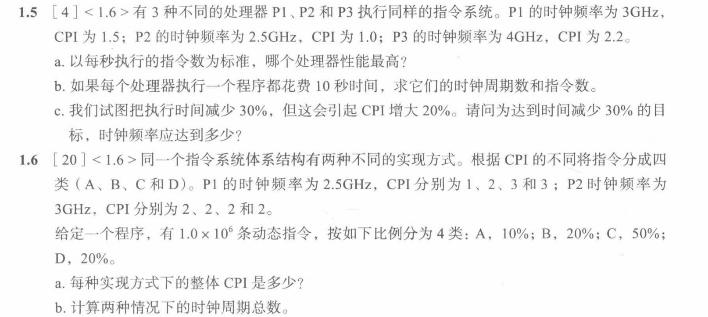
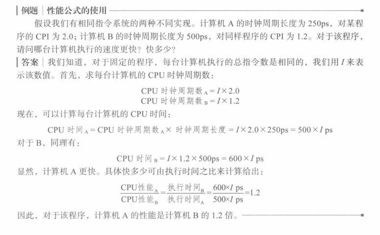
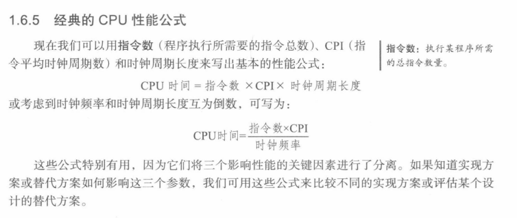
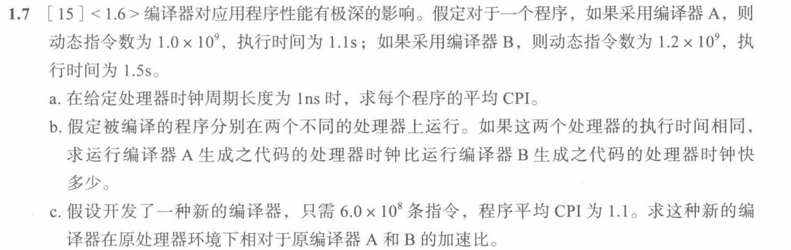

# 组原第一章作业



## 1.5
见例题


```
a、可算得P1、P2、P3每秒执行的指令数分别为(1/(CPI*时钟周期长度))
    P1:3/1.5=2
    P2:2.5/1=2.5
    P3:4/2.2=1.82
    可见P2处理器性能最高
b、可算得P1、P2、P3时钟周期数(T/时钟周期长度)、指令数(T/时钟周期长度/CPI)分别为0
    P1: 时钟周期数=3T 指令数=3T/1.5=T/2
    P2: 时钟周期数=2.5T 指令数=2.5T/1=T/2.5
    P3: 时钟周期数=4T 指令数=4T/2.2=T/1.82
c、
    对于固定程序总指令数I处理器有
    CPU时间(执行时间) = I*CPI/时钟频率
    由题知
    0.7 * CPU时间(执行时间) = I * 1.2 * CPI/时钟频率

    即时钟频率应为原来的5/6
```
## 1.6
```
a、整体CPI分别为
    P1:1*0.1+2*0.2+3*0.5+3*0.2=2.6
    P2:2*0.1+2*0.2+2*0.5+2*0.2=2

b、时钟周期总数分别为
    P1:(1*0.1+2*0.2+3*0.5+3*0.2)*10^6=2.6*10^6
    P2:(2*0.1+2*0.2+2*0.5+2*0.2)*10^6=2*10^6
```



## 1.7
```
a、
    A、1.1/1=1.1
    B、1.5/1.2=1.25
b、
    快(1.5/1.2)/(1*1.1)=1.14倍    
c、
    相对于A：0.66/1.1=0.6   
    相对于B：0.66/1.5=0.44

```